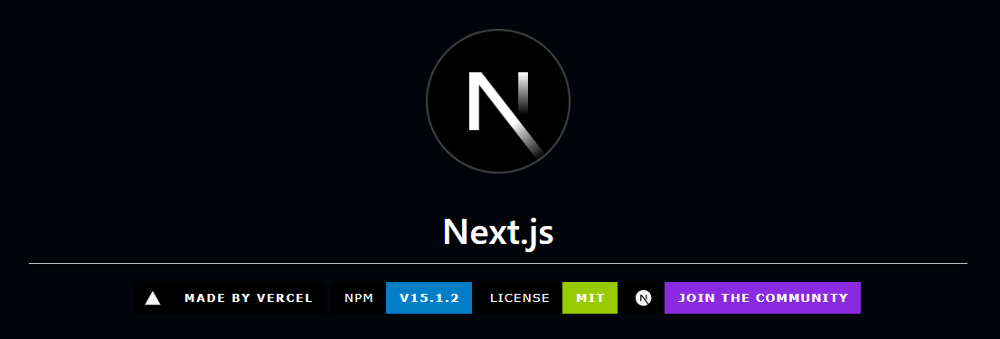
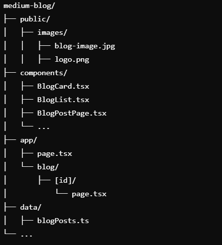

# basic-next-js# Medium Blog with Next.js & ShadCN

 <!-- Replace with your actual image path -->

A modern, responsive blog built using Next.js and ShadCN UI components. This blog showcases posts with dynamic content, beautiful gradients, and a user-friendly interface.

## Features

- **Responsive Design**: The layout adjusts to different screen sizes.
- **Dynamic Routing**: Each blog post has its unique page using dynamic routes in Next.js.
- **Client-Side Rendering**: Uses React hooks (`useRouter`) for client-side functionality.
- **ShadCN UI Components**: Beautiful UI elements for a modern blog experience.
- **Gradient Backgrounds**: Attractive color gradients for headers and sections.

## Installation

1. Clone the repository:
   ```bash
   git clone https://github.com/your-username/medium-blog.git
   cd medium-blog


## Project Structure

 <!-- Replace with your actual image path -->